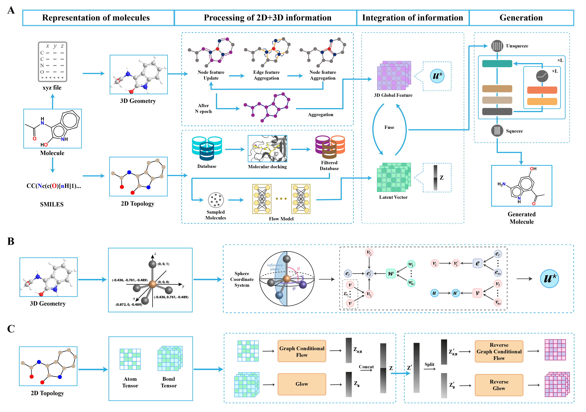
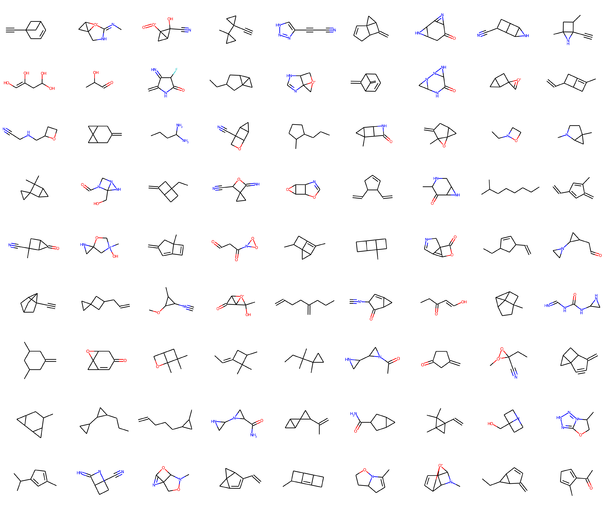
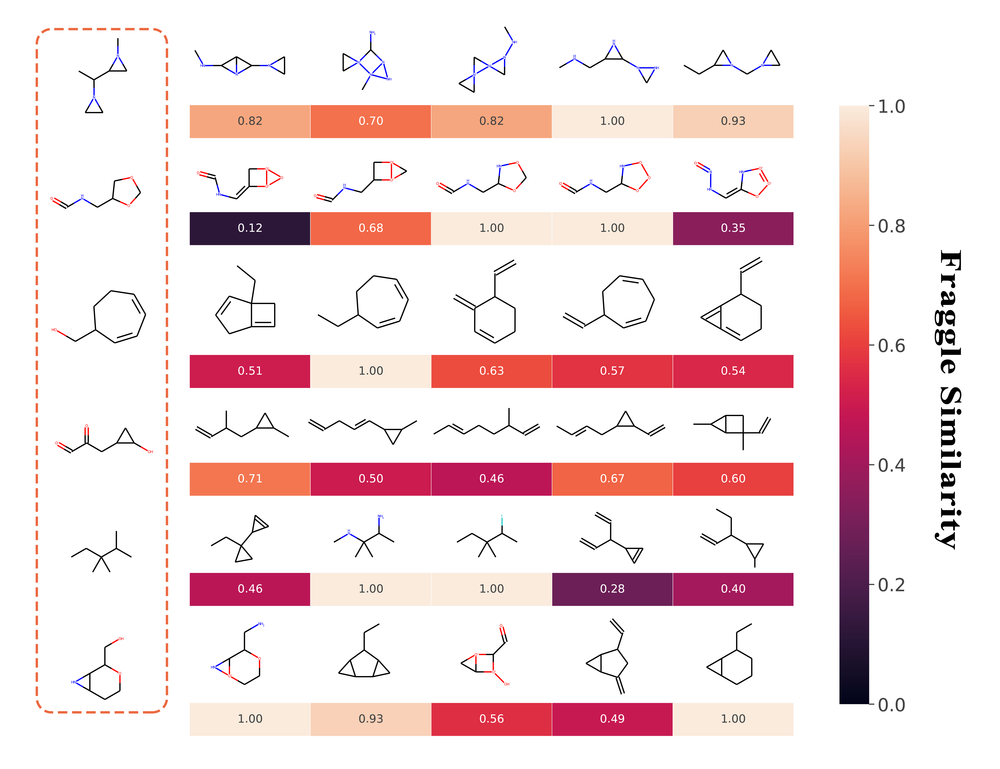

# TIDFlow

TIDFlow (Three dim Information Docking Flow), a flow-based molecular graph generative model using three-dim information and molecular docking. 

It encodes the 3D information of the molecule into a complete representation of the molecule and then feeds the 3D representation of the molecule into the trained flow model as input information. Moreover, we use the binding energy obtained from molecular docking between molecules in the training set and the target protein to assist in the training of TIDFlow, allowing TIDFlow to generate molecules with stronger inhibitory effects on the target protein.



## 1. Requirements:
```
python=3.9.10

cairo=1.16.0
cairocffi=1.3.0
cairosvg=2.5.2
cudatoolkit=11.6.0
cudnn=8.2.1.32
pandas=1.4.1
pdb2pqr=3.5.2
scikit-learn=1.0.2
scipy=1.8.0
seaborn=0.11.2
tensorboard=2.6.0
tensorflow=2.7.0
torch=1.10.2+cu113
torch-cluster=1.5.9
torch-geometric=2.0.3
torch-scatter=2.0.9
torch-sparse=0.6.12
torch-spline-conv=1.2.1
torchaudio=0.10.2+cu113
torchvision=0.11.3+cu113
tornado=6.1
tqdm=4.63.0
```

## 2. Data Download
The data used in this experiment can be downloaded from Google Drive.
```
https://drive.google.com/drive/folders/1bg1mS6eTON37rz9Z85HNiJmJX0sh70oK?usp=sharing
```
Or you can download it from the QM9 dataset website and process it yourself.
```
http://quantum-machine.org/datasets/
```
```
cd data
python two_dim_process.py --data_name qm9
python read_xyz_files.py
```

## 3. Molecular Docking
Before you can perform molecular docking, you need to install openbabel and pdb2pqr.
```
# Convert xyz files of molecules to pdb files
obabel xyz_example.xyz -O xyz_example.pdb

# Converting protein pdb files to pqr files
pdb2pqr30 --ff=AMBER 1a1p.pdb 1a1p.pqr

# Prepare receptor file
python dock/MGLTools/mgltools_x86_64Linux2_1.5.7/MGLToolsPckgs/prepare_receptor4.py -r your_protein.pdb -o your_protein.pdbqt -A hydrogens

# Prepare ligand file
python dock/MGLTools/mgltools_x86_64Linux2_1.5.7/MGLToolsPckgs/prepare_ligand4.py -l your_molecule.pdb -o your_molecule.pdbqt -A bonds_hydrogens

cd dock

# Perform molecular docking
./vina --config conf.txt --receptor your_protein.pdbqt --ligand your_molecule.pdbqt
```

## 4. Model Training
### Training model for QM9 dataset:
The hyperparameters are set in config.py. We have set the default hyperparameters.
```
python train_flow.py
```
Wait for the Flow model to finish training, then run:
```
python train_sphere.py
```
### You can also download and use our trained models in:
```
https://drive.google.com/drive/folders/14PygyXfDZ7HxrngQ0gcXDDuIzSVZLK8D?usp=sharing
```

## 5. Experiment

### 5.1. Random generation
First set random_gen to 'True' in GenerateConfig. Then run:
```
python generate.py
```
#### Examples of randomly generated molecules


### 5.2. Generate molecules with 3D information
First set gen_with_3d to 'True' in GenerateConfig. Then run:
```
python generate.py
```
#### Examples of molecules generated with 3d information


### 5.3 Property optimization

If you have not downloaded our trained model, first you need to adjust ‘mode’ in 'OptimPropConfig' to train，then run:

```
python property_optimize.py
```

After training, adjust ‘mode’ in 'OptimPropConfig' to gen, then run the previous command.
